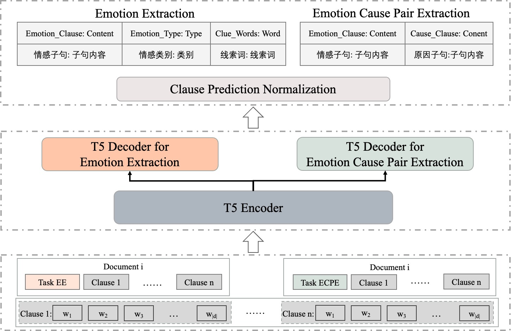
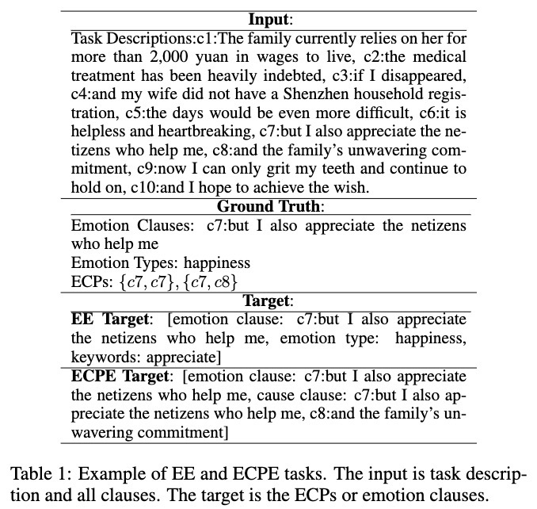

# MTG-ECPE

## Generative Joint Multi-task Learning for Emotion-Cause Pair Extraction

## Quick Links
- [Overview](#overview)
- [Generative Paradigm](#generative_paradigm)
- [Code Usage](#code)
  - [Requirement](#requirement)
  - [Dataset](#data)
  - [Generation Model](#g_model)
  - [Training and Evaluating](#train&eval)


----------

## Overview<a name="overview" />

> The framework incorporates three parts: multi-task generative framework setting, multi-task learning objective, clause prediction normalization.

<p align="center">
  
</p>

----------
## Generative Paradigm<a name="generative_paradigm" />

> Example of EE and ECPE tasks. The input is task description and all clauses. The target is the ECPs or emotion clauses.

<p align="center">
  
</p>

----------

## Code Usage<a name="code" />


----------
### Requirement<a name="requirement" />

``` bash 
conda create -n mtg python=3.8
```

``` bash
# CUDA 11.6
conda install pytorch==1.13.1 torchvision==0.14.1 torchaudio==0.13.1 pytorch-cuda=11.6 -c pytorch -c nvidia
# CUDA 11.7
conda install pytorch==1.13.1 torchvision==0.14.1 torchaudio==0.13.1 pytorch-cuda=11.7 -c pytorch -c nvidia
```

```bash
pip install -r requirements.txt
```

----------

### Dataset<a name="data" />

Chinese data ([Sina City News](data%ecpe%cn-10)) and English data ([NTCIR-13](data%ecpe%)).

----------
### Generation Model<a name="g_model" />

A. Randeng-T5 for Chinese data: 
  - [IDEA-CCNL/Randeng-T5-77M](https://huggingface.co/IDEA-CCNL/Randeng-T5-77M),  
B. T5-small for English data:
  - [google-t5/t5-small](https://huggingface.co/google-t5/t5-small), 

----------
### Training and Evaluating<a name="train&eval" />

Use the [main.py](main.py) script to run system. 

----------

